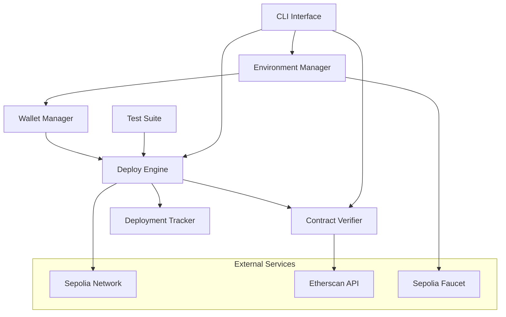
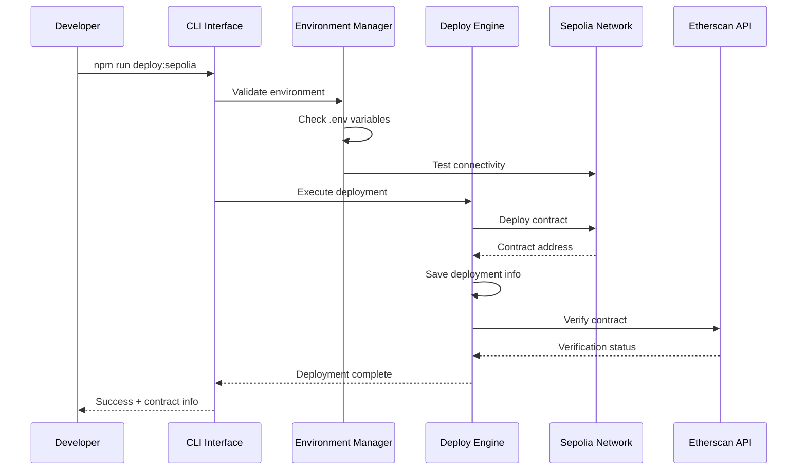

# Design Document: Deploy ZombieFactory na Sepolia

## Overview

Este documento descreve o design técnico para implementar um sistema completo de deploy do contrato ZombieFactory na rede de teste Sepolia. O sistema utilizará Hardhat Ignition como ferramenta principal de deploy, seguindo as melhores práticas recomendadas pela Nomic Foundation.

A solução será construída sobre a infraestrutura Hardhat existente, aproveitando o Hardhat Toolbox Viem já configurado no projeto. O design prioriza automação, segurança e facilidade de uso, fornecendo scripts robustos e documentação clara.

## Architecture

### Componentes Principais



### Fluxo de Deploy



## Components and Interfaces

### 1. Environment Manager

**Responsabilidade:** Gerenciar configurações de ambiente e validação de conectividade.

**Interface:**

```typescript
interface EnvironmentManager {
  validateEnvironment(): Promise<ValidationResult>
  checkSepoliaConnectivity(): Promise<boolean>
  getWalletBalance(): Promise<string>
  generateEnvTemplate(): void
}

interface ValidationResult {
  isValid: boolean
  missingVariables: string[]
  errors: string[]
}
```

**Implementação:**

- Validação de variáveis de ambiente obrigatórias
- Teste de conectividade com RPC Sepolia
- Verificação de saldo da wallet
- Geração de template .env com instruções

### 2. Deploy Engine (Hardhat Ignition)

**Responsabilidade:** Executar deploy usando Hardhat Ignition com configurações otimizadas.

**Interface:**

```typescript
interface DeployEngine {
  deployZombieFactory(): Promise<DeploymentResult>
  estimateGasCost(): Promise<GasEstimate>
  validateDeployment(address: string): Promise<boolean>
}

interface DeploymentResult {
  contractAddress: string
  transactionHash: string
  blockNumber: number
  gasUsed: bigint
  deploymentCost: string
}
```

**Implementação:**

- Módulo Hardhat Ignition para ZombieFactory
- Estimativa de gas antes do deploy
- Validação pós-deploy chamando função do contrato
- Tratamento de erros com mensagens claras

### 3. Contract Verifier

**Responsabilidade:** Verificar código fonte no Etherscan automaticamente.

**Interface:**

```typescript
interface ContractVerifier {
  verifyContract(deploymentInfo: DeploymentResult): Promise<VerificationResult>
  getVerificationStatus(address: string): Promise<VerificationStatus>
}

interface VerificationResult {
  success: boolean
  etherscanUrl?: string
  error?: string
}
```

**Implementação:**

- Integração com plugin @nomiclabs/hardhat-etherscan
- Verificação automática pós-deploy
- Retry logic para falhas temporárias
- Links diretos para Etherscan

### 4. Deployment Tracker

**Responsabilidade:** Rastrear e armazenar histórico de deployments.

**Interface:**

```typescript
interface DeploymentTracker {
  saveDeployment(deployment: DeploymentInfo): Promise<void>
  getDeploymentHistory(): Promise<DeploymentInfo[]>
  getLatestDeployment(): Promise<DeploymentInfo | null>
}

interface DeploymentInfo {
  network: string
  contractName: string
  address: string
  transactionHash: string
  blockNumber: number
  timestamp: number
  gasUsed: bigint
  deploymentCost: string
  verified: boolean
  etherscanUrl?: string
}
```

**Implementação:**

- Arquivo JSON para persistência
- Histórico completo de deployments
- Metadados detalhados para cada deploy

## Data Models

### Configuração de Ambiente

```typescript
interface EnvironmentConfig {
  SEPOLIA_RPC_URL: string
  SEPOLIA_PRIVATE_KEY: string
  ETHERSCAN_API_KEY: string
  GAS_PRICE?: string
  GAS_LIMIT?: string
}
```

### Módulo Hardhat Ignition

```typescript
// ignition/modules/ZombieFactory.ts
import { buildModule } from '@nomicfoundation/hardhat-ignition/modules'

const ZombieFactoryModule = buildModule('ZombieFactoryModule', (m) => {
  const zombieFactory = m.contract('ZombieFactory')

  return { zombieFactory }
})

export default ZombieFactoryModule
```

### Configuração Hardhat Atualizada

```typescript
interface HardhatConfig {
  networks: {
    sepolia: {
      url: string
      accounts: string[]
      gasPrice?: number
      gas?: number
    }
  }
  etherscan: {
    apiKey: string
  }
  ignition: {
    requiredConfirmations: number
  }
}
```

## Correctness Properties

_Uma propriedade é uma característica ou comportamento que deve ser verdadeiro em todas as execuções válidas de um sistema - essencialmente, uma declaração formal sobre o que o sistema deve fazer. As propriedades servem como ponte entre especificações legíveis por humanos e garantias de correção verificáveis por máquina._

Baseado na análise dos critérios de aceitação, identifiquei as seguintes propriedades testáveis:

### Property 1: Environment Validation Consistency

_Para qualquer_ conjunto de variáveis de ambiente, a validação deve retornar resultados consistentes - se as variáveis obrigatórias estão presentes e válidas, a validação deve passar; caso contrário, deve falhar com mensagens específicas sobre o que está faltando.
**Validates: Requirements 1.2**

### Property 2: Wallet Balance Validation

_Para qualquer_ wallet configurada, o sistema deve corretamente identificar se o saldo é suficiente para deploy, considerando estimativas de gas atuais da rede.
**Validates: Requirements 1.5**

### Property 3: Successful Deploy Returns Valid Address

_Para qualquer_ deploy bem-sucedido, o sistema deve sempre retornar um endereço de contrato válido (formato hexadecimal de 42 caracteres começando com 0x).
**Validates: Requirements 2.3**

### Property 4: Deploy Failure Error Handling

_Para qualquer_ falha de deploy, o sistema deve fornecer mensagens de erro que incluam informações acionáveis sobre a causa da falha.
**Validates: Requirements 2.4**

### Property 5: Deployment Information Persistence

_Para qualquer_ deploy bem-sucedido, todas as informações essenciais (endereço, hash da transação, gas usado) devem ser salvas corretamente no arquivo de histórico.
**Validates: Requirements 2.5**

### Property 6: Post-Deploy Validation

_Para qualquer_ contrato deployado, a validação pós-deploy deve confirmar que o contrato está funcionando corretamente chamando uma função pública.
**Validates: Requirements 2.6**

### Property 7: Automatic Verification Trigger

_Para qualquer_ deploy bem-sucedido, o sistema deve automaticamente iniciar o processo de verificação no Etherscan.
**Validates: Requirements 3.1**

### Property 8: Verification Configuration Consistency

_Para qualquer_ solicitação de verificação, o sistema deve usar configurações de compilação que correspondem exatamente às usadas durante o deploy.
**Validates: Requirements 3.2**

### Property 9: Verification Failure Guidance

_Para qualquer_ falha de verificação, o sistema deve fornecer instruções específicas para verificação manual.
**Validates: Requirements 3.3**

### Property 10: Verification Success Confirmation

_Para qualquer_ verificação bem-sucedida, o sistema deve confirmar o status e fornecer evidência da verificação.
**Validates: Requirements 3.4**

### Property 11: Etherscan Link Generation

_Para qualquer_ verificação concluída, o sistema deve gerar e fornecer um link válido para o contrato no Etherscan.
**Validates: Requirements 3.5**

### Property 12: Zombie Creation Event Emission

_Para qualquer_ zombie criado no contrato, o evento NewZombie deve ser emitido com os parâmetros corretos.
**Validates: Requirements 4.3**

### Property 13: Zombie Storage Consistency

_Para qualquer_ zombie criado, os dados devem ser armazenados corretamente no array de zombies do contrato.
**Validates: Requirements 4.4**

### Property 14: Contract State Query Accuracy

_Para qualquer_ estado do contrato, a função getZombiesCount deve retornar o número correto de zombies armazenados.
**Validates: Requirements 4.5**

### Property 15: Gas Estimation Accuracy

_Para qualquer_ deploy, a estimativa de gas deve estar dentro de uma margem razoável do gas real utilizado.
**Validates: Requirements 6.1**

### Property 16: Cost Calculation Precision

_Para qualquer_ estimativa de gas, o custo em ETH deve ser calculado corretamente usando o gas price atual da rede.
**Validates: Requirements 6.2**

### Property 17: Gas Configuration Flexibility

_Para qualquer_ configuração de gas fornecida, o sistema deve aceitar e usar os valores especificados para gas price e gas limit.
**Validates: Requirements 6.3**

### Property 18: Actual Cost Reporting

_Para qualquer_ deploy concluído, o sistema deve reportar com precisão o gas real utilizado e o custo final.
**Validates: Requirements 6.4**

### Property 19: Insufficient Balance Error Handling

_Para qualquer_ situação onde o saldo da wallet é insuficiente, o sistema deve fornecer instruções claras para obter mais ETH de teste.
**Validates: Requirements 6.5**

### Property 20: Deployment History Persistence

_Para qualquer_ deploy bem-sucedido, todas as informações devem ser persistidas no arquivo deployments.json com integridade de dados.
**Validates: Requirements 7.1**

### Property 21: Complete Deployment Metadata

_Para qualquer_ entrada no histórico de deployments, deve incluir todos os campos obrigatórios: endereço, hash, block number e timestamp.
**Validates: Requirements 7.2**

### Property 22: Historical Data Accumulation

_Para qualquer_ sequência de múltiplos deploys, o sistema deve manter um histórico completo sem perder dados de deploys anteriores.
**Validates: Requirements 7.3**

### Property 23: Deployment Query Functionality

_Para qualquer_ consulta por data ou endereço, o sistema deve retornar os deployments correspondentes do histórico.
**Validates: Requirements 7.4**

### Property 24: Data Integrity Validation

_Para qualquer_ operação de salvamento de dados, o sistema deve validar a integridade dos dados antes de confirmar o salvamento.
**Validates: Requirements 7.5**

<function_calls>
<invoke name="prework">
<parameter name="featureName">zombie-sepolia-deploy

## Error Handling

### Categorias de Erro

**1. Erros de Configuração**

- Variáveis de ambiente ausentes ou inválidas
- Chave privada malformada
- RPC URL inacessível
- API key do Etherscan inválida

**Estratégia:** Validação prévia com mensagens específicas e instruções de correção.

**2. Erros de Conectividade**

- Falha de conexão com Sepolia
- Timeout de transação
- Problemas de rede intermitentes

**Estratégia:** Retry automático com backoff exponencial e fallback para RPC alternativo.

**3. Erros de Deploy**

- Saldo insuficiente para gas
- Falha na compilação do contrato
- Revert durante deploy
- Gas limit insuficiente

**Estratégia:** Pré-validação de saldo, estimativa de gas conservadora, e mensagens de erro detalhadas.

**4. Erros de Verificação**

- API rate limiting do Etherscan
- Mismatch de código fonte
- Timeout de verificação

**Estratégia:** Retry com delay, verificação manual como fallback, e logs detalhados.

### Implementação de Error Handling

```typescript
class DeploymentError extends Error {
  constructor(
    message: string,
    public code: string,
    public recoverable: boolean = false,
    public instructions?: string
  ) {
    super(message)
  }
}

// Exemplo de uso
if (balance < estimatedCost) {
  throw new DeploymentError(
    `Saldo insuficiente: ${balance} ETH, necessário: ${estimatedCost} ETH`,
    'INSUFFICIENT_BALANCE',
    true,
    'Obtenha ETH de teste em: https://sepoliafaucet.com'
  )
}
```

## Testing Strategy

### Abordagem Dual de Testes

O sistema utilizará uma combinação de **testes unitários** e **testes baseados em propriedades** para garantir cobertura abrangente:

- **Testes unitários**: Verificam exemplos específicos, casos extremos e condições de erro
- **Testes de propriedade**: Verificam propriedades universais em todas as entradas
- Ambos são complementares e necessários para cobertura abrangente

### Configuração de Testes de Propriedade

**Framework:** [fast-check](https://github.com/dubzzz/fast-check) para TypeScript
**Configuração:** Mínimo 100 iterações por teste de propriedade
**Tagging:** Cada teste deve referenciar sua propriedade do documento de design

Formato da tag: **Feature: zombie-sepolia-deploy, Property {number}: {property_text}**

### Estrutura de Testes

```
test/
├── unit/
│   ├── environment-manager.test.ts
│   ├── deploy-engine.test.ts
│   ├── contract-verifier.test.ts
│   └── deployment-tracker.test.ts
├── property/
│   ├── environment-validation.property.test.ts
│   ├── deployment-flow.property.test.ts
│   └── data-integrity.property.test.ts
└── integration/
    ├── sepolia-deploy.integration.test.ts
    └── etherscan-verification.integration.test.ts
```

### Exemplo de Teste de Propriedade

```typescript
import fc from 'fast-check'

describe('Property Tests - Environment Validation', () => {
  it('should validate environment variables consistently', () => {
    // Feature: zombie-sepolia-deploy, Property 1: Environment Validation Consistency
    fc.assert(
      fc.property(
        fc.record({
          SEPOLIA_RPC_URL: fc.option(fc.webUrl()),
          SEPOLIA_PRIVATE_KEY: fc.option(
            fc.hexaString({ minLength: 64, maxLength: 64 })
          ),
          ETHERSCAN_API_KEY: fc.option(
            fc.string({ minLength: 32, maxLength: 32 })
          ),
        }),
        (envVars) => {
          const result = environmentManager.validateEnvironment(envVars)

          const hasAllRequired =
            envVars.SEPOLIA_RPC_URL &&
            envVars.SEPOLIA_PRIVATE_KEY &&
            envVars.ETHERSCAN_API_KEY

          expect(result.isValid).toBe(hasAllRequired)
          if (!hasAllRequired) {
            expect(result.missingVariables.length).toBeGreaterThan(0)
          }
        }
      ),
      { numRuns: 100 }
    )
  })
})
```

### Testes de Integração

**Ambiente de Teste:** Sepolia testnet
**Pré-requisitos:**

- Wallet de teste com ETH suficiente
- API key válida do Etherscan
- RPC endpoint confiável

**Cobertura:**

- Deploy completo end-to-end
- Verificação automática no Etherscan
- Interação com contrato deployado
- Persistência de dados de deployment

### Mocking Strategy

**Princípio:** Minimizar mocks para testes mais realistas
**Exceções:**

- APIs externas em testes unitários
- Operações de rede custosas
- Cenários de falha específicos

**Implementação:**

```typescript
// Mock apenas para cenários específicos
const mockEtherscanApi = {
  verify: jest.fn().mockResolvedValue({ success: true }),
  getVerificationStatus: jest.fn().mockResolvedValue('verified'),
}
```
